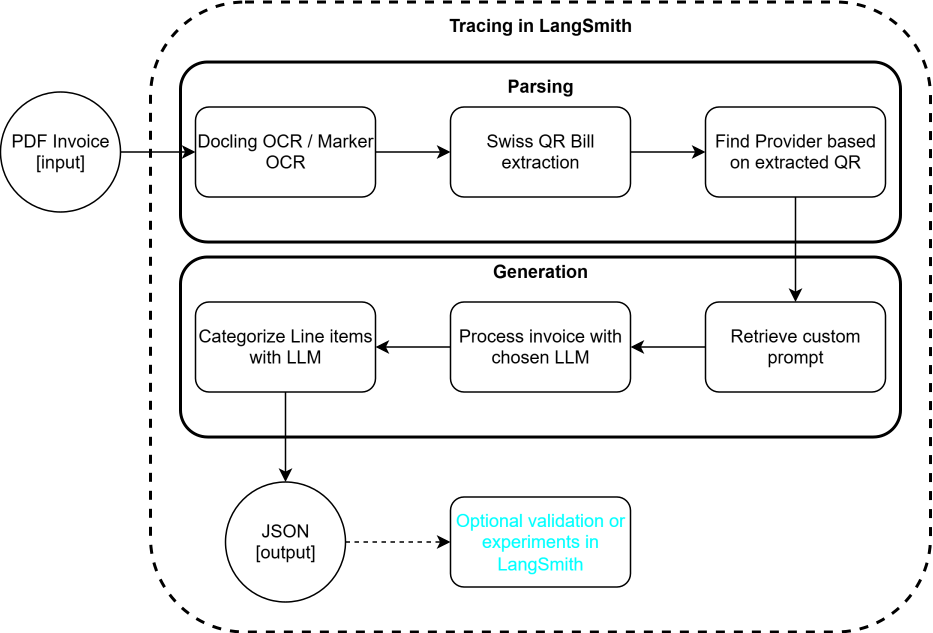
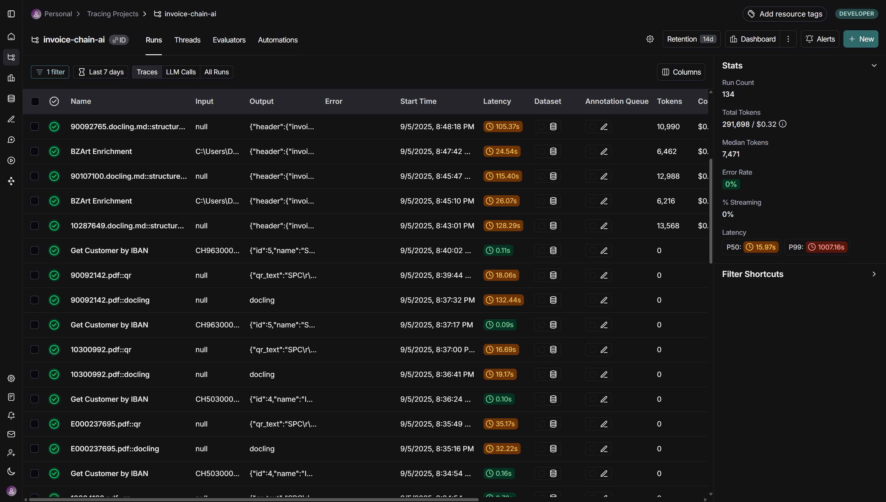
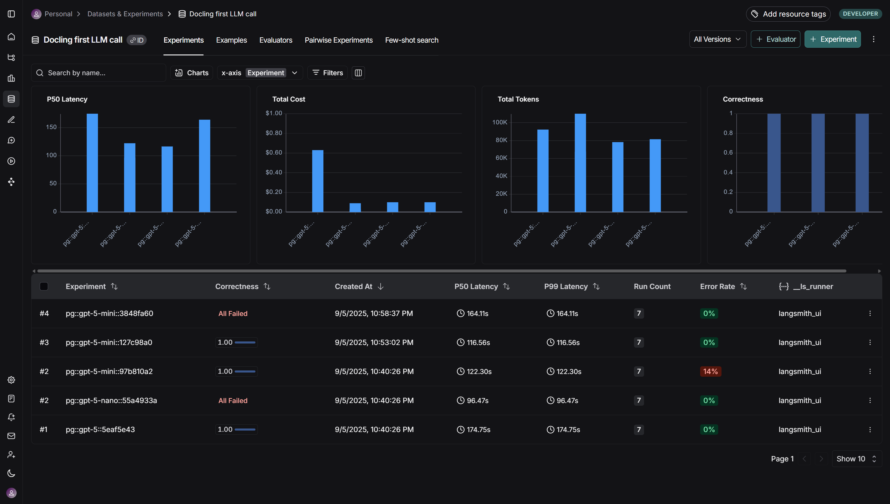

# Invoice AI

End‑to‑end pipeline to:

- Convert energy / invoice PDFs to Markdown (Docling or Marker)
- Scan & parse Swiss QR bill codes (WeChat QR + OpenCV fallback)
- Lookup / enrich customer data from Postgres
- Produce structured JSON output via LangChain + OpenAI-compatible model
- Trace runs and sub-steps with LangSmith

---

## Architecture



---

## LangSmith Trace Example





---

## Tech Stack

| Area                    | Tools                                   |
| ----------------------- | --------------------------------------- |
| PDF Parsing             | Docling, Marker                         |
| LLM / Structured Output | LangChain, OpenAI-compatible chat model |
| Tracing / Observability | LangSmith                               |
| QR Detection            | WeChat QR (Caffe), OpenCV               |
| DB                      | Postgres (via `psycopg`)                |
| Orchestration           | Custom CLI + runners                    |

---

## Setup

Conda:

1. `conda env create -f environment.yml`
2. `conda activate invoice-chain-ai`
3. `pip install -r requirements.txt`

Copy `.env.example` to `.env` and adjust:

- `DATABASE_URL`
- `OPENAI_API_KEY`
- `STRUCTURED_OUTPUT_MODEL` (default falls back)
- LangSmith keys if tracing enabled

Optional: verify DB

```powershell
docker compose up -d
python -m invoice_chain_ai.db.seed
```

---

## CLI Commands

(Entry point module: `invoice_chain_ai.main`)

### Parse PDF (Docling)

```powershell
python -m invoice_chain_ai.main --pdf path\to\file.pdf --parser docling
```

### Parse PDF (Marker) with LLM assist

```powershell
python -m invoice_chain_ai.main --pdf path\to\file.pdf --parser marker --use-llm
```

### QR only

```powershell
python -m invoice_chain_ai.main --pdf path\to\file.pdf --qr
```

### Full pipeline (parse + QR + structured output)

```powershell
python -m invoice_chain_ai.main --pdf path\to\file.pdf --parser marker --use-llm --structured-output
```

### Structured output only (reuse existing run folder)

```powershell
python -m invoice_chain_ai.main --run-dir .\invoice_chain_ai\output\some_run --structured-output
```

### Example (from training data)

```powershell
python -m invoice_chain_ai.main --pdf .\training_data\sig\10300992.pdf --parser marker --use-llm
python -m invoice_chain_ai.main --pdf .\training_data\sig\10300992.pdf --parser docling
python -m invoice_chain_ai.main --pdf .\training_data\sig\10300992.pdf --qr
python -m invoice_chain_ai.main --run-dir .\invoice_chain_ai\output\sig_10300992 --structured-output
```

---

## Output Layout

Each run creates:

```
invoice_chain_ai/output/<basename>_<filename>/
  original.pdf
  <basename>.marker.md | <basename>.docling.md
  qr.json # extracted QR code data
  customer.json # customer prompt from DB
  structured_output.json # final structured output
```

---

## Key Modules

- Runners / orchestration: [`invoice_chain_ai/runners.py`](invoice_chain_ai/runners.py)
- CLI: [`invoice_chain_ai/cli.py`](invoice_chain_ai/cli.py)
- QR decode + parsing: [`invoice_chain_ai/qr.py`](invoice_chain_ai/qr.py)
- Structured output (LLM): [`invoice_chain_ai/structured_output.py`](invoice_chain_ai/structured_output.py)
- Post-processing: [`invoice_chain_ai/postprocess_bz.py`](invoice_chain_ai/postprocess_bz.py)
- IO helpers: [`invoice_chain_ai/io_utils.py`](invoice_chain_ai/io_utils.py)

---

## LangChain & LangSmith

- Structured extraction uses `ChatOpenAI.with_structured_output(...)` for schema-safe JSON.
- Each step (`Scan QR Code`, `Convert PDF to Markdown`, structured output) is decorated with `@traceable` enabling hierarchical traces in LangSmith.
- Runnable wrapping in runners assigns readable run names.

---

## QR Code Detection

Pipeline:

1. Render each PDF page (PyMuPDF)
2. Preprocess (grayscale / contrast)
3. Try WeChat QR detector (if model assets present)
4. Fallback to OpenCV multi / single detect
5. Parse Swiss Payment Code (fields beginning with SPC)
6. Normalize into structured invoice + addresses

Models expected in:

```
invoice_chain_ai/WeChatQR/
  detect.prototxt
  detect.caffemodel
  sr.prototxt
  sr.caffemodel
```
